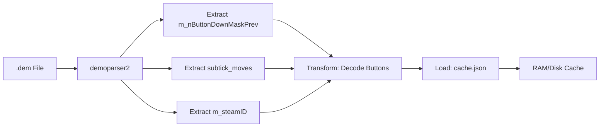
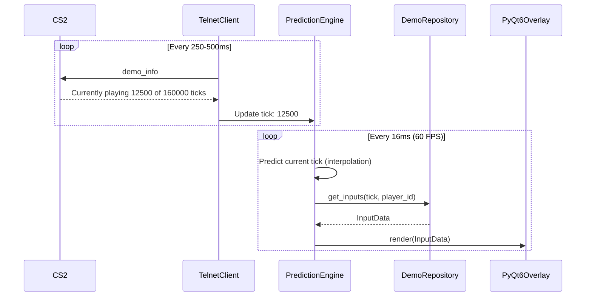
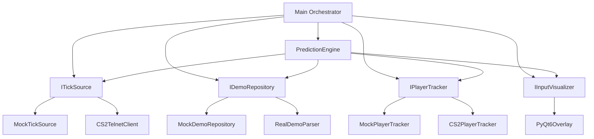

# Architecture Documentation

## CS2 Subtick Input Visualizer - System Architecture

### 1. Overview

The system uses a **Hybrid Architecture** combining offline ETL (Extract, Transform, Load) with real-time synchronization to achieve high performance during demo playback.

```
┌─────────────────────────────────────────────────────────────┐
│                    OFFLINE PHASE (ETL)                      │
├─────────────────────────────────────────────────────────────┤
│  .dem File → demoparser2 → Transform → cache.json/binary   │
└─────────────────────────────────────────────────────────────┘
                            ↓
┌─────────────────────────────────────────────────────────────┐
│                    RUNTIME PHASE                            │
├─────────────────────────────────────────────────────────────┤
│  CS2 (Telnet) ←→ Sync Engine ←→ Prediction Engine          │
│                       ↓                                     │
│                  Cache Reader ←→ UI Overlay                 │
└─────────────────────────────────────────────────────────────┘
```

---

## 2. Core Principles

### 2.1 SOLID Principles

- **Single Responsibility**: Each module has one reason to change
  - `DemoParser` only parses demos
  - `TelnetClient` only handles network sync
  - `InputVisualizer` only renders UI

- **Open/Closed**: Extensible without modifying existing code
  - New input sources via `ITickSource` interface
  - New visualizations via `IInputVisualizer` interface

- **Liskov Substitution**: Mock and Real implementations are interchangeable
  - `MockTickSource` ↔ `CS2TelnetClient`
  - `MockDemoRepository` ↔ `RealDemoParser`

- **Interface Segregation**: Focused interfaces
  - `ITickSource` only provides tick information
  - `IPlayerTracker` only tracks player ID

- **Dependency Inversion**: Depend on abstractions
  - Core logic depends on `ITickSource`, not concrete implementations

---

## 3. Core Interfaces

### 3.1 ITickSource

Provides current game tick information.

```python
from abc import ABC, abstractmethod

class ITickSource(ABC):
    """Abstract interface for tick synchronization sources."""

    @abstractmethod
    async def get_current_tick(self) -> int:
        """Get the current tick number from the game.

        Returns:
            int: Current tick number (0-based)
        """
        pass

    @abstractmethod
    async def connect(self) -> bool:
        """Establish connection to the tick source.

        Returns:
            bool: True if connection successful
        """
        pass

    @abstractmethod
    async def disconnect(self) -> None:
        """Close connection to the tick source."""
        pass

    @abstractmethod
    def is_connected(self) -> bool:
        """Check if connection is active.

        Returns:
            bool: Connection status
        """
        pass
```

**Implementations:**
- `MockTickSource`: Timer-based simulation (time.time() * 64)
- `CS2TelnetClient`: Real CS2 connection via Telnet

---

### 3.2 IDemoRepository

Provides access to parsed demo input data.

```python
from abc import ABC, abstractmethod
from typing import Optional
from domain.models import InputData

class IDemoRepository(ABC):
    """Abstract interface for demo data access."""

    @abstractmethod
    def get_inputs(self, tick: int, player_id: str) -> Optional[InputData]:
        """Get input data for a specific tick and player.

        Args:
            tick: Tick number
            player_id: Player SteamID or EntityID

        Returns:
            InputData object or None if not found
        """
        pass

    @abstractmethod
    def load_demo(self, demo_path: str) -> bool:
        """Load and parse demo file.

        Args:
            demo_path: Path to .dem file

        Returns:
            bool: True if loaded successfully
        """
        pass

    @abstractmethod
    def get_tick_range(self) -> tuple[int, int]:
        """Get the range of available ticks.

        Returns:
            tuple: (min_tick, max_tick)
        """
        pass
```

**Implementations:**
- `MockDemoRepository`: Returns pre-generated test data from cache.json
- `RealDemoParser`: Uses demoparser2 to extract data from .dem files

---

### 3.3 IPlayerTracker

Tracks which player is currently being spectated.

```python
from abc import ABC, abstractmethod
from typing import Optional

class IPlayerTracker(ABC):
    """Abstract interface for tracking spectated player."""

    @abstractmethod
    async def get_current_player(self) -> Optional[str]:
        """Get the currently spectated player ID.

        Returns:
            str: Player SteamID or EntityID, or None if unknown
        """
        pass

    @abstractmethod
    async def update(self) -> None:
        """Update player tracking information from game."""
        pass
```

**Implementations:**
- `MockPlayerTracker`: Returns fixed player ID
- `CS2PlayerTracker`: Queries CS2 via Telnet for current POV

---

### 3.4 IInputVisualizer

Renders input visualization overlay.

```python
from abc import ABC, abstractmethod
from domain.models import InputData

class IInputVisualizer(ABC):
    """Abstract interface for input visualization."""

    @abstractmethod
    def render(self, data: InputData) -> None:
        """Render input data to the overlay.

        Args:
            data: Input data to visualize
        """
        pass

    @abstractmethod
    def show(self) -> None:
        """Show the overlay window."""
        pass

    @abstractmethod
    def hide(self) -> None:
        """Hide the overlay window."""
        pass

    @abstractmethod
    def set_position(self, x: int, y: int) -> None:
        """Set overlay position on screen.

        Args:
            x: X coordinate
            y: Y coordinate
        """
        pass
```

**Implementations:**
- `PyQt6Overlay`: Full PyQt6-based overlay with keyboard/mouse visualization

---

## 4. Data Flow

### 4.1 Offline Phase (ETL)



**Steps:**
1. User selects .dem file (~400MB Faceit/GOTV demo)
2. `demoparser2` extracts required fields
3. Button masks decoded to key names (W, A, S, D, etc.)
4. Subtick offsets calculated (0.0-1.0 range)
5. Data indexed by tick and player ID
6. Saved to optimized cache structure

---

### 4.2 Runtime Phase



**Steps:**
1. Telnet polls CS2 every 250-500ms for current tick
2. Prediction engine interpolates between polls (64 Hz tick rate)
3. For each render frame, fetch input data from cache
4. UI updates keyboard/mouse visual state
5. Prediction corrects drift when new network data arrives

---

## 5. Component Dependencies



---

## 6. Extensibility for Future Features

The architecture supports easy addition of new features:

### 6.1 Grenade Visualization

```python
class IGrenadeTracker(ABC):
    @abstractmethod
    def get_grenades(self, tick: int) -> list[GrenadeData]:
        pass
```

Add to orchestrator:
```python
grenades = grenade_tracker.get_grenades(current_tick)
visualizer.render_grenades(grenades)
```

### 6.2 Input Recording

```python
class IInputRecorder(ABC):
    @abstractmethod
    def record(self, tick: int, data: InputData) -> None:
        pass
```

### 6.3 Analytics

```python
class IInputAnalyzer(ABC):
    @abstractmethod
    def analyze(self, inputs: list[InputData]) -> Statistics:
        pass
```

---

## 7. Testing Strategy

### 7.1 Unit Testing

Each component tested in isolation using mocks:

```python
def test_prediction_engine():
    mock_tick_source = MockTickSource()
    mock_repo = MockDemoRepository()

    engine = PredictionEngine(mock_tick_source, mock_repo)
    # Test prediction logic
```

### 7.2 Integration Testing

Test component interactions:

```python
def test_sync_with_prediction():
    telnet = CS2TelnetClient()
    engine = PredictionEngine(telnet, demo_repo)
    # Test sync correction
```

### 7.3 UI Testing

Develop UI with mock data:

```python
app = PyQt6Overlay()
mock_orchestrator = Orchestrator(
    MockTickSource(),
    MockDemoRepository(),
    MockPlayerTracker()
)
```

---

## 8. Configuration

All components configured via dependency injection:

```python
# Development mode (mocks)
config = Config(
    tick_source=MockTickSource(),
    demo_repo=MockDemoRepository(),
    player_tracker=MockPlayerTracker()
)

# Production mode (real)
config = Config(
    tick_source=CS2TelnetClient(host="127.0.0.1", port=2121),
    demo_repo=RealDemoParser(),
    player_tracker=CS2PlayerTracker()
)
```

---

## 9. Performance Considerations

- **ETL Phase**: One-time cost, can take 30-60 seconds for 400MB demo
- **Cache Loading**: ~100ms for JSON, <10ms for binary format
- **Network Polling**: 2-10ms latency per request
- **Prediction**: <1ms CPU time
- **UI Rendering**: Hardware accelerated, <2% CPU at 60 FPS

---

## 10. Security & Safety

- **VAC Safety**: Fully external application
- **No Memory Reading**: All data from demo files or Telnet API
- **Required Flags**: `-insecure` for CS2 to disable VAC during development
- **Port Security**: Telnet on localhost only (127.0.0.1:2121)
